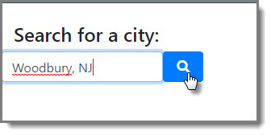
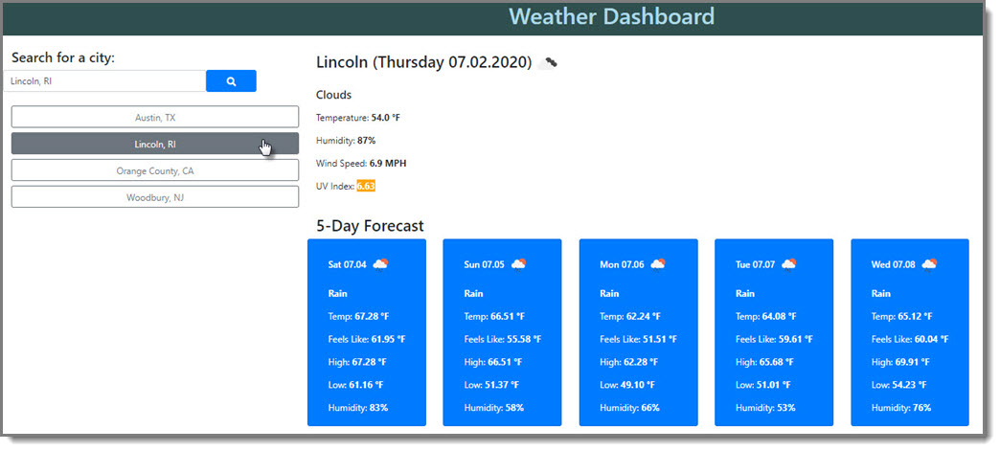

# Weather Dashboard (Week 6: Focus on Server-Side APIs)

## Application
Access the application here: https://cbayley-edu.github.io/weather-dashboard/

   

## Overview
Welcome to your personal Weather Dashboard that will give you weather for your desired location. Once you search for a city, it will save your previous searches as easy to click buttons. Use these buttons to view the weather for the selected city. You will always be presented with the last city you typed in the search box when you revisit the page.

## Usage

**Search for a city by typing in the name and clicking search:**

   

#### Use a previous search by clicking on a button to display the weather for that location:
   

#### The UV Index will show the appropriate color based on the following scale:
   

## License
MIT License

Copyright (c) 2020 Christina Bayley

Permission is hereby granted, free of charge, to any person obtaining a copy
of this software and associated documentation files (the "Software"), to deal
in the Software without restriction, including without limitation the rights
to use, copy, modify, merge, publish, distribute, sublicense, and/or sell
copies of the Software, and to permit persons to whom the Software is
furnished to do so, subject to the following conditions:

The above copyright notice and this permission notice shall be included in all
copies or substantial portions of the Software.

THE SOFTWARE IS PROVIDED "AS IS", WITHOUT WARRANTY OF ANY KIND, EXPRESS OR
IMPLIED, INCLUDING BUT NOT LIMITED TO THE WARRANTIES OF MERCHANTABILITY,
FITNESS FOR A PARTICULAR PURPOSE AND NONINFRINGEMENT. IN NO EVENT SHALL THE
AUTHORS OR COPYRIGHT HOLDERS BE LIABLE FOR ANY CLAIM, DAMAGES OR OTHER
LIABILITY, WHETHER IN AN ACTION OF CONTRACT, TORT OR OTHERWISE, ARISING FROM,
OUT OF OR IN CONNECTION WITH THE SOFTWARE OR THE USE OR OTHER DEALINGS IN THE
SOFTWARE.